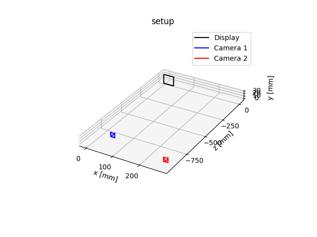
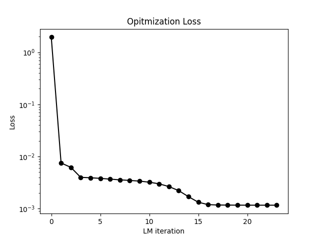
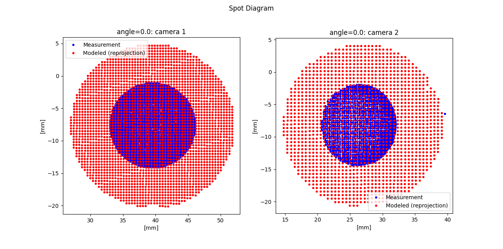
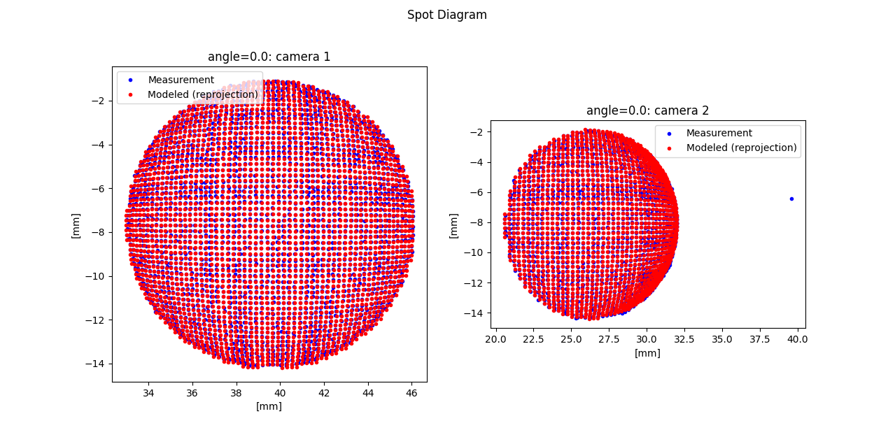
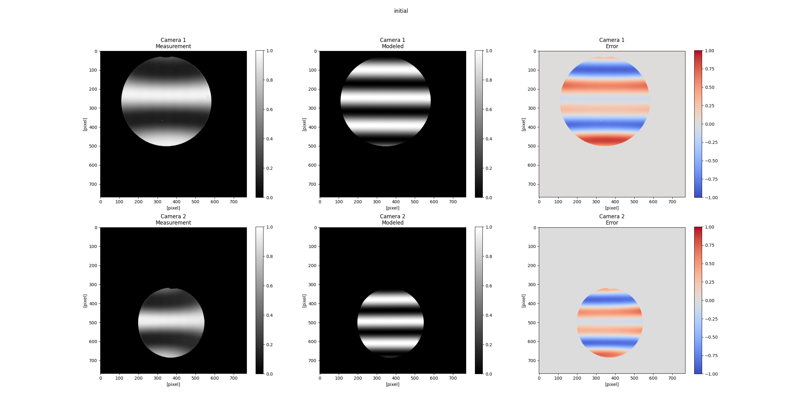
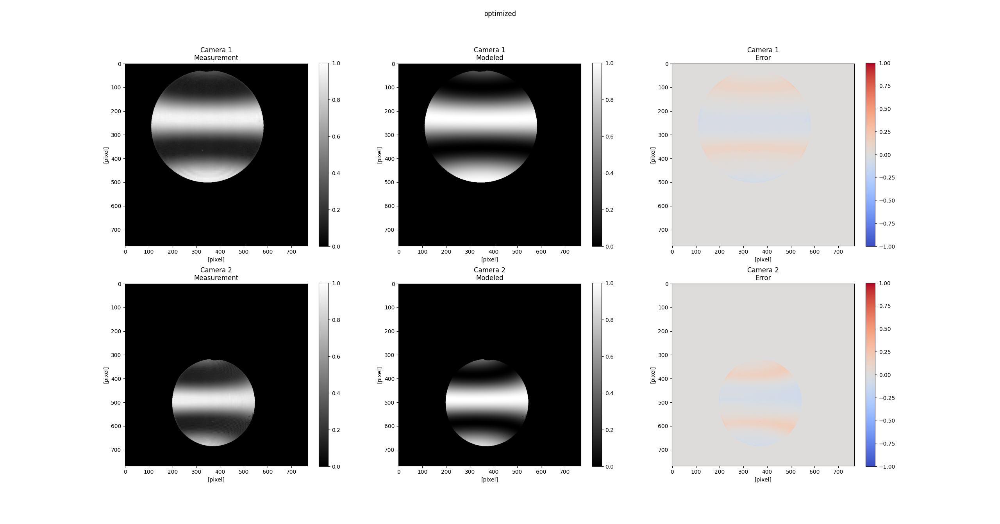

# Towards self-calibrated lens metrology by differentiable refractive deflectometry
This is the PyTorch implementation for our paper "Towards self-calibrated lens metrology by differentiable refractive deflectometry".
### [Project Page](https://vccimaging.org/Publications/Wang2021DiffDeflectometry/) | [Paper](https://vccimaging.org/Publications/Wang2021DiffDeflectometry/Wang2021DiffDeflectometry.pdf)

[Towards self-calibrated lens metrology by differentiable refractive deflectometry](https://vccimaging.org/Publications/Wang2021DiffDeflectometry/Wang2021DiffDeflectometry.pdf)  
 [Congli Wang](https://congliwang.github.io),
 [Ni Chen](https://ni-chen.github.io), and
 [Wolfgang Heidrich](https://vccimaging.org/People/heidriw)<br>
King Abdullah University of Science and Technology (KAUST)<br>
OSA Optics Express 2021


Figure: Dual-camera refractive deflectometry for lens metrology. (a) Hardware setup. (b) Captured phase-shifted images, from which on-screen intersections are obtained. (c) A ray tracer models the setup by ray tracing each parameterized refractive surface, obtaining the modeled intersections. (d) Unknown parameters and pose are jointly optimized by minimizing the error between measurement and modeled.

## Features

This repository implements a PyTorch differentiable ray tracer for deflectometry. The solver enables:
- Fast (few seconds on a GPU), simultaneous lens parameters and pose estimation with gradients estimated by a differentiable ray tracer.
- Rendering of photo-realistic images from a CMM-free, computationally calibrated metrology setup.
- A fringe analyzer to solve displacements from phase-shifting patterns.

## Quick Start

### Real Experiment Example

[`demo_experiments.py`](./demo_experiments.py) reproduces one of the paper's experimental results.  Prerequisites:

- Download raw image data `*.npz` from the google drive [here](https://drive.google.com/file/d/15a3T0wL7sWDaEXsAeZM0S7YXRS-fXRNO/view?usp=sharing).
- Put the downloaded `*.npz` into directory `./20210403/measurement/LE1234-A`.

Then run [`demo_experiments.py`](./demo_experiments.py).  The script should output the following figures:

|                |                           |
| :---------------------------------: | :-------------------------------------------: |
| The physical setup for experiments. | Optimization loss with respect to iterations. |

|       |
| :---------------------------------------: |
|  Spot diagrams on the display (initial).  |
|     |
| Spot diagrams on the display (optimized). |

|                            |
| :-------------------------------------------------------: |
|  Measurement images / modeled images / error.  (initial)  |
|                          |
| Measurement images / modeled images / error.  (optimized) |

## Citation
```bibtex
@article{wang2021towards,
  title={Towards self-calibrated lens metrology by differentiable refractive deflectometry},
  author={Wang, Congli and Chen, Ni and Heidrich, Wolfgang},
  journal={Optics Express},
  volume={29},
  number={19},
  pages={30284--30295},
  year={2021},
  publisher={Optical Society of America}
}
```

## Contact
Please either open an issue, or contact Congli Wang <congli.wang@kaust.edu.sa> for questions.

