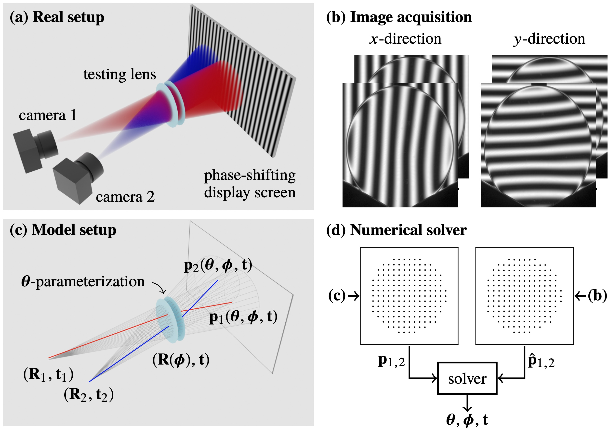

# Towards self-calibrated lens metrology by differentiable refractive deflectometry
This is the PyTorch implementation for our paper "Towards self-calibrated lens metrology by differentiable refractive deflectometry". Code will be released shortly.
### [Project Page](https://vccimaging.org/Publications/Wang2021DiffDeflectometry/) | [Paper](https://vccimaging.org/Publications/Wang2021DiffDeflectometry/Wang2021DiffDeflectometry.pdf)

[Towards self-calibrated lens metrology by differentiable refractive deflectometry](https://vccimaging.org/Publications/Wang2021DiffDeflectometry/Wang2021DiffDeflectometry.pdf)  
 [Congli Wang](https://congliwang.github.io),
 [Ni Chen](https://ni-chen.github.io), and
 [Wolfgang Heidrich](https://vccimaging.org/People/heidriw)<br>
 King Abdullah University of Science and Technology (KAUST)<br>
OSA Optics Express 2021


Figure: Dual-camera refractive deflectometry for lens metrology. (a) Hardware setup. (b) Captured phase-shifted images, from which on-screen intersections are obtained. (c) A ray tracer models the setup by ray tracing each parameterized refractive surface, obtaining the modeled intersections. (d) Unknown parameters and pose are jointly optimized by minimizing the error between measurement and modeled.

## Citation
```bibtex
@article{wang2021towards,
  title={Towards self-calibrated lens metrology by differentiable refractive deflectometry},
  author={Wang, Congli and Chen, Ni and Heidrich, Wolfgang},
  journal={Optics Express},
  volume={29},
  number={19},
  pages={30284--30295},
  year={2021},
  publisher={Optical Society of America}
}
```

## Contact
Please either open an issue, or contact Congli Wang <congli.wang@kaust.edu.sa> for questions.

